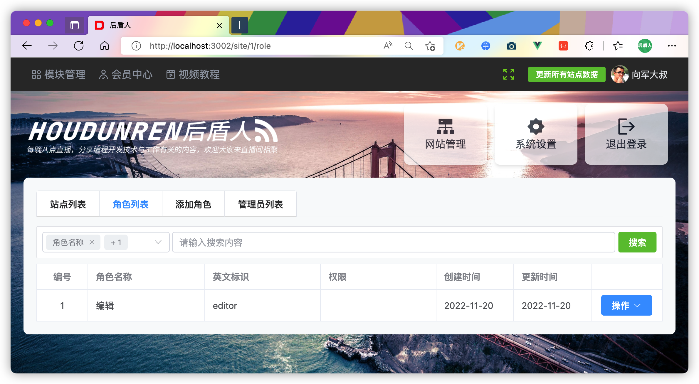

## 前端脚手架

> 向军大叔晚八点在 [抖音](https://live.douyin.com/houdunren) 和 [bilibli](https://space.bilibili.com/282190994) 直播，欢迎大家光临直播间交流。


houdunren-vue帮助大家加快前端项目的开发，本项目提供了前端开发的很多基础功能。使用 vite、typescript、vue3、element-plus、pinia、vue-router、axios、tailwindcss等技术开发。


### 在线文档

请查看[在线手册](https://doc.houdunren.com/houdunren-vue/1%20%E5%9F%BA%E7%A1%80%E7%9F%A5%E8%AF%86.html)学习使用，也希望大家在[后盾人](https://www.houdunren.com)网站对反馈该项目的问题。


## 版本库

我会将项目提交到 [github](https://github.com/houdunwang/vue) 与 [gitee](https://gitee.com/houdunren/vue) 两个版本库。


## 项目特点

* 组件自动加载

* 提供丰富的组件

* 支持typescript

* 使用vue3+pinia等新技术

* 项目结构清晰，方便快速开发

* 全局表单验证

* tailwindcss与element-plus样式控制

* 多个后台管理界面

* 移动端自适应用

* 基于token身份验证


## 安装项目

现在我们来安装前端脚手架项目，我介绍三种安装方式

 

### 全局CLI

首先全局安装 `houdunren-vue` 命令

```
npm install -g houdunren-vue
#或
pnpm add -g houdunren-vue
```

然后执行 `houdunren-vue` 命令，按提示进行操作

```
➜  code houdunren-vue
  _                     _
 | |__   ___  _   _  __| |_   _ _ __  _ __ ___ _ __    ___ ___  _ __ ___
 | '_ \ / _ \| | | |/ _` | | | | '_ \| '__/ _ \ '_ \  / __/ _ \| '_ ` _ \
 | | | | (_) | |_| | (_| | |_| | | | | | |  __/ | | || (_| (_) | | | | | |
 |_| |_|\___/ \__,_|\__,_|\__,_|_| |_|_|  \___|_| |_(_)___\___/|_| |_| |_|

欢迎使用后盾人前端脚手架，向军大叔每晚8点在抖音与bilibli直播
? 请输入目录名 hd
✔ 项目创建成功，请依次执行以下命令
cd hd
npm install
npm run dev
```

**更新命令**

你可以执行以下命令获取 `houdunren-vue` 获取更新

```
npm update -g
#或
pnpm update -g
```


### npx

如果只想在项目中使用 houdunren-vue，使用npx是简单的

```
npm houdunren-vue
```


### GIT安装

你也通过 [github](https://github.com/houdunwang/vue) 或 [gitee](https://gitee.com/houdunren/vue) 下载源码进行安装。

```
$ git clone https://gitee.com/houdunren/vue houdunren-vue
$ cd houdunren-vue
$ npm install
$ npm run dev
```


## 项目预览





## 每晚直播

作者向军大叔会在每晚八点进行直播，与大家交流技术与生活。


请扫描下方二维码进入直播间，我们一起交流成长。

| 抖音                                            | Bilibili                                         |
| ----------------------------------------------- | ------------------------------------------------ |
|  |  |

